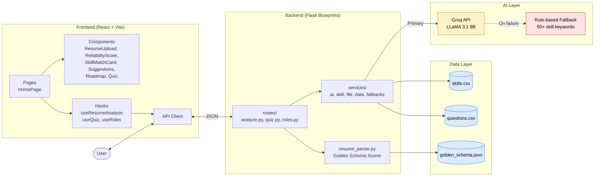

# Skill Navigator V2

An AI-powered career navigation platform that analyzes resumes, identifies skill gaps, and provides personalized learning roadmaps for job seekers.

---

## Candidate Name

Arnav Uniyal

## Scenario Chosen

Skill-Bridge Career Navigator (Scenario 2)

---

## Quick Start

### Prerequisites

* Python 3.10+
* Node.js 18+
* npm

### Run Commands

**Backend:**

```bash
cd backend
pip install -r requirements.txt
python run.py
```

**Frontend:**

```bash
cd frontend
npm install
npm run dev
```

### Test Commands

```bash
cd backend
pytest
```

Tests cover unit logic (skill extraction, gap analysis, scoring math, fallbacks), file parsing (malformed/unsupported uploads), and integration (all routes including role-not-found and missing-role 400s).

---

## Architecture



The hybrid AI + rule-based fallback pattern runs through every feature: if Groq is rate-limited or down, deterministic logic keeps the app fully functional.

---

## Project Structure

```
skill-navigator-v2/
├── backend/
│   ├── app.py                        # Flask app factory + blueprint registration
│   ├── run.py                        # Local dev entry point
│   ├── config.py                     # Env vars, paths, model config
│   ├── resume_parser.py              # Golden schema reliability scorer
│   ├── pytest.ini
│   ├── requirements.txt
│   ├── .env.example
│   ├── data/
│   │   ├── skills.csv                # Role → required skills mapping
│   │   ├── questions.csv             # Quiz question bank
│   │   └── golden_schema.json        # ATS benchmark schema
│   ├── routes/
│   │   ├── analyze.py                # POST /analyze (main pipeline)
│   │   ├── quiz.py                   # GET /quiz?role=
│   │   └── roles.py                  # GET /roles
│   ├── services/
│   │   ├── ai_service.py             # All Groq LLM calls
│   │   ├── skill_service.py          # Rule-based extraction, gap analysis
│   │   ├── file_service.py           # PDF/DOCX parsing
│   │   ├── data_service.py           # CSV loaders
│   │   └── fallbacks.py              # Role-specific suggestions + roadmaps
│   └── tests/
│       ├── conftest.py
│       ├── test_skill_service.py     # 8 unit tests
│       ├── test_resume_parser.py     # 5 scoring tests
│       ├── test_routes.py            # 6 integration tests
│       ├── test_file_service.py      # 2 malformed-upload tests
│       └── test_fallbacks.py         # 4 fallback tests
│
├── frontend/
│   └── src/
│       ├── App.jsx                   # Top-level routing (50 lines)
│       ├── main.jsx
│       ├── api/
│       │   ├── client.js             # Fetch wrappers
│       │   └── parsers.js            # Suggestion/roadmap text parsers
│       ├── hooks/
│       │   ├── useRoles.js
│       │   ├── useResumeAnalysis.js
│       │   └── useQuiz.js
│       ├── styles/
│       │   └── tokens.js             # Colors, shared style objects
│       ├── pages/
│       │   └── HomePage.jsx
│       └── components/
│           ├── Header.jsx
│           ├── ErrorBanner.jsx
│           ├── ResumeUpload.jsx
│           ├── RoleSelector.jsx
│           ├── ReliabilityScore.jsx
│           ├── SkillMatchCard.jsx
│           ├── SkillsList.jsx
│           ├── Suggestions.jsx
│           ├── Roadmap.jsx
│           └── Quiz.jsx
│
├── DESIGN.md
└── README.md
```

---

## Tech Stack

| Layer | Technology |
| --- | --- |
| Frontend | React (Vite) |
| Backend | Python Flask (Blueprints) |
| AI Provider | Groq API (LLaMA 3.1 8B) |
| File Parsing | PyMuPDF, python-docx |
| Testing | pytest (25 tests) |
| Data | CSV and JSON synthetic datasets |

---

## Features

* **Resume Upload** — PDF and Word (.docx) supported
* **AI Skill Extraction** — LLaMA 3.1 with rule-based fallback
* **Skill Match Score** — Resume vs target role
* **Resume Reliability Score** — Compared against a golden ATS benchmark schema
* **AI Suggestions** — Role-specific structured recommendations
* **Visual Learning Roadmap** — Interactive tree/branch layout
* **Role Quiz** — 5 randomized MCQs per role with explanations
* **Smart Fallback** — Deterministic backup for every AI-powered feature

---

## AI Integration + Fallback

| Feature | AI Path | Fallback Path |
| --- | --- | --- |
| Skill Extraction | LLaMA 3.1 via Groq | Rule-based keyword matching across 50+ skills |
| Suggestions | LLaMA 3.1 via Groq | Role-specific structured suggestions |
| Roadmap | LLaMA 3.1 via Groq | Role-specific structured roadmap with real resources |
| Quiz | CSV-based static questions | Friendly error message with retry option |
| File Upload | PyMuPDF and python-docx | Clear error message with manual paste option |

---

## AI Disclosure

**Did you use an AI assistant (Copilot, ChatGPT, etc.)?**
Yes. Claude (Anthropic) was used for development guidance throughout the project. Groq API (LLaMA 3.1 8b) was used as the AI engine powering the application features.

**How did you verify the suggestions?**
Every suggestion was tested manually in the browser and terminal before being kept. Each feature was verified end-to-end including the happy path and edge cases. AI-generated code was reviewed line by line.

---

## Security

* API keys stored in `.env` and never committed
* `.env` is listed in `.gitignore`
* Synthetic data only — no real personal information included
* `.env.example` provided as a safe template

---

## Demo Video

<https://youtu.be/XfJda8UPhmM>

## Live Demo

Frontend: <https://skill-navigator-final.vercel.app>
Backend: <https://skill-navigator-final.onrender.com>

> Note: Backend may take 15–20 seconds to wake up (free tier on Render).
